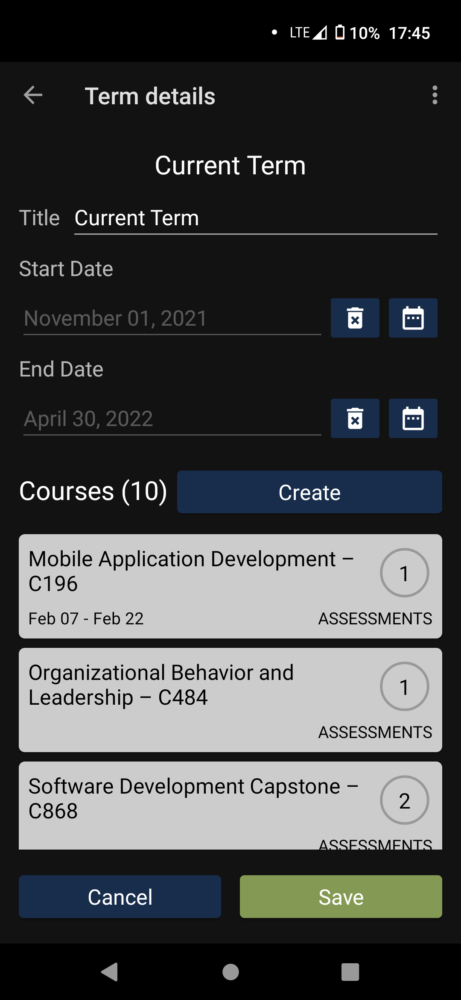
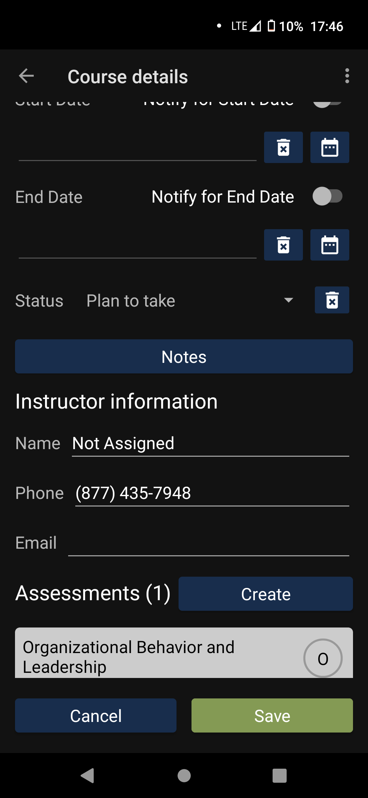
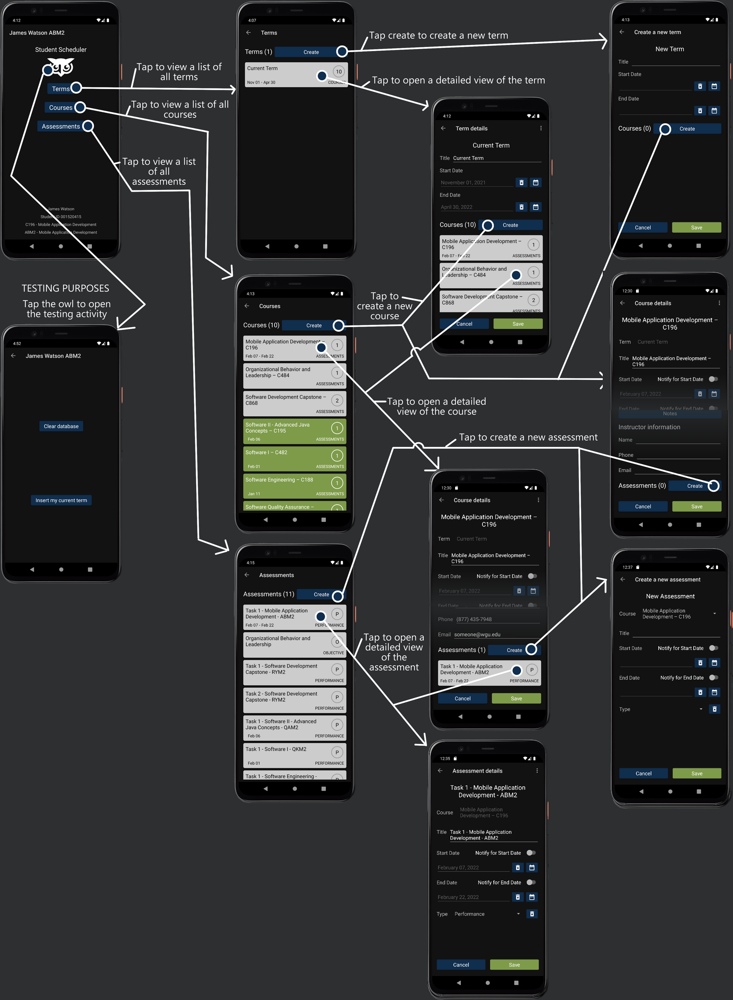

<h1 align="center">Student Scheduler</h1>
 

This android project was created for Mobile Applications Development class at Western Governor's Univserity.

 

The application implements multidimensional functionality, local storage, and notifications. The multidimensional functionality is more clearly demonstrated in the storeboard below than I can type. The storage is a simple database for for the terms, courses, assessments, and notifications. The application is themed after WGU's official application.

<h2 align="center">Main screen</h2>

<h2 align="center">Term screen</h2>

<h2 align="center">Course screen</h2>

<h2 align="center">Storyboard</h2>

